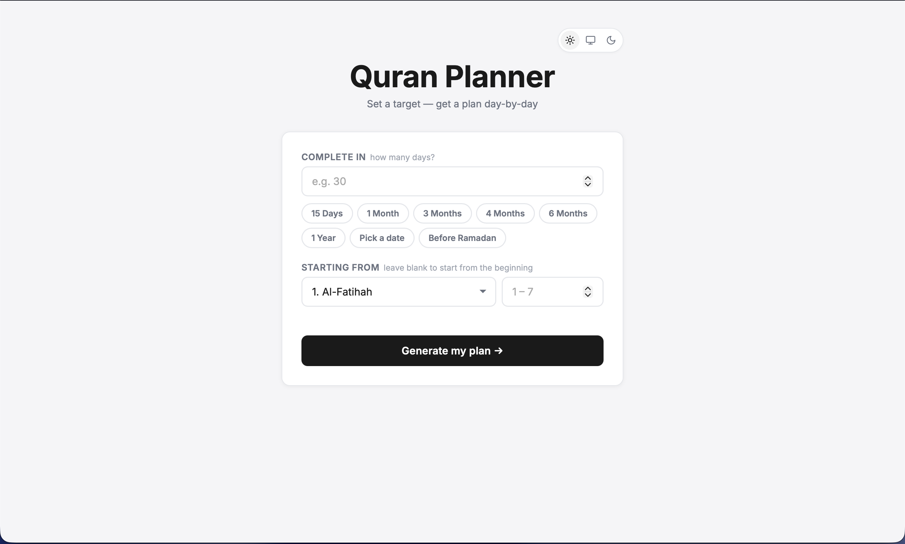
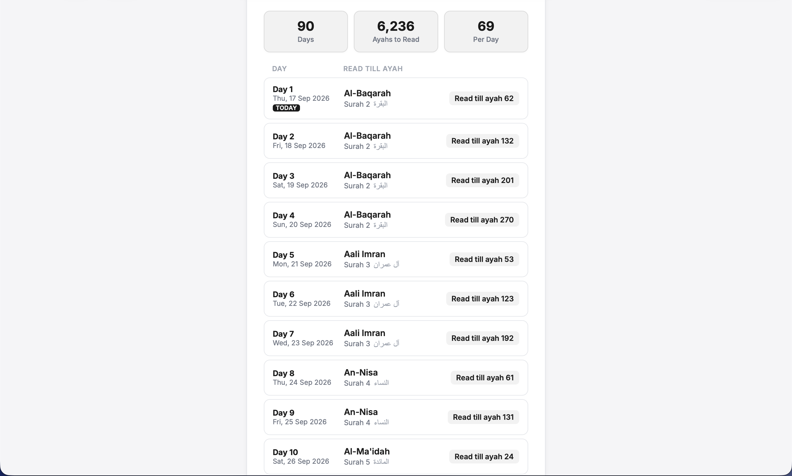

# Quran Planner
Get a day by day plan, to finish reading the Quran in x number of days. Export the plan as a high-resolution image.

<!-- <p align="center">
  <a href="https://zainkhalid.org/quran-planner.html" style="text-decoration: none;">
    
  </a>
</p> -->

## Screenshots

<p align="center">
  
  
</p>

<p align="center">
  
  
</p>

## Quick Start

Open [`quran-planner.html`](quran-planner.html) directly in any modern web browser, or serve it locally:

```bash
python3 -m http.server 5173
```

Then visit:
```
http://localhost:5173/quran-planner.html
```

## Tech Stack

- **HTML5 & Semantic Markup**: 
- **Vanilla CSS**: Custom design system with CSS custom properties (`:root` / `html.dark`), responsive flexbox & grid layouts.
- **Vanilla JavaScript**: Pure ES6+, `Intl.DateTimeFormat` for Islamic calendar calculation, and `localStorage` API.
- **html2canvas**: Client-side image rendering for PNG downloads.

