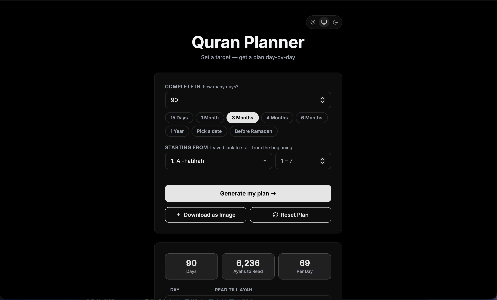
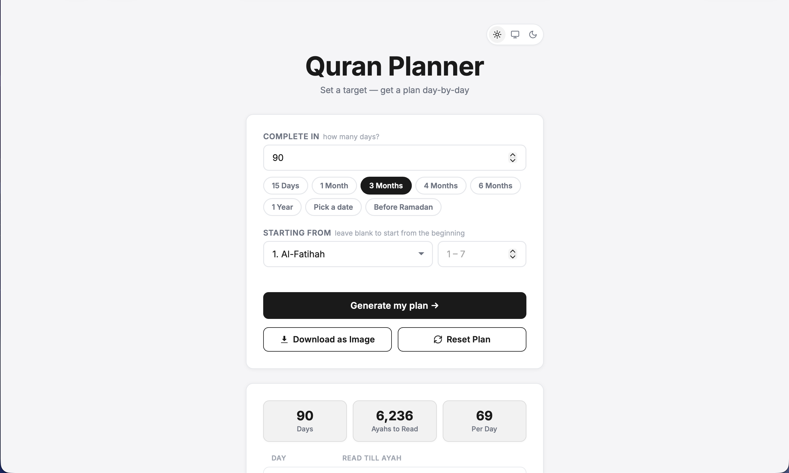

# Quran Planner

Generate a day-by-day reading plan to finish the Quran in a chosen number of days — starting from any Surah and Ayah — and export it as a high-resolution image.

## Table of Contents

- [Screenshots](#screenshots)
- [Quick Start](#quick-start)
- [Tech Stack](#tech-stack)
- [How the Planning Algorithm Works](#how-the-planning-algorithm-works)
  - [1. Building a Cumulative Timeline](#1-building-a-cumulative-timeline)
  - [2. Locating Your Starting Point](#2-locating-your-starting-point)
  - [3. Splitting the Remaining Ayahs Across Days](#3-splitting-the-remaining-ayahs-across-days)
  - [4. Mapping Each Day Back to a Surah & Ayah](#4-mapping-each-day-back-to-a-surah--ayah)

<p align="center">
  <a href="https://zainkhalid.org/quran-planner.html">
    
  </a>
</p>

## Screenshots

<p align="center">
  
  
</p>

<p align="center">
  
  
</p>

## Quick Start

Open [`index.html`](index.html) directly in any modern browser, or serve it locally:

```bash
python3 -m http.server 5173
```

Then visit `http://localhost:5173/index.html`.

## Tech Stack

| Layer | Details |
|---|---|
| Markup | Semantic HTML5 |
| Styling | Vanilla CSS — custom properties (`:root` / `html.dark`), flexbox & grid |
| Logic | Vanilla ES6+ JavaScript, `Intl.DateTimeFormat` for Islamic calendar dates, `localStorage` for persistence |
| Export | [html2canvas](https://html2canvas.hertzen.com/) for client-side PNG rendering |

## How the Planning Algorithm Works

The planner takes a starting point (Surah + Ayah) and a target number of days, then evenly distributes the remaining ayahs so you finish exactly on schedule — no day is left noticeably shorter or longer due to rounding.

Four steps make this work:

### 1. Building a Cumulative Timeline

The Quran has **6,236 ayahs across 114 Surahs**. On startup, the app builds a *prefix sum array* — a running total of ayahs before each Surah — so any ayah's position can be found instantly instead of re-counting every time.

```javascript
// CUMULATIVE_AYAHS[i] = total ayahs before Surah at array index i
const CUMULATIVE_AYAHS = (() => {
  const arr = [0];
  let sum = 0;
  for (let i = 0; i < SURAHS.length; i++) {
    sum += SURAHS[i].ayahs;
    arr.push(sum);
  }
  return arr;
})();
```

This produces a single timeline from `1` to `6,236`:

| Surah | Ayahs | Global range |
|---|---|---|
| 1 – Al-Fatiha | 7 | 1–7 |
| 2 – Al-Baqarah | 286 | 8–293 |
| 3 – Ali 'Imran | 200 | 294–493 |
| ... | ... | ... |
| 114 – An-Nas | 6 | 6231–6236 |

```javascript
// The resulting array:
[0, 7, 293, 493, 669, /* ... */ 6230, 6236]
//  ↑                                    ↑
//  before Surah 1                       total Quran ayahs
```

> **A note on indexing:** everywhere in this codebase, `SURAHS` is a plain 0-indexed array (`SURAHS[0]` = Surah 1, `SURAHS[113]` = Surah 114). Any variable named `*Idx` (`surahIdx`, `startSurahIdx`) refers to this 0-based position — not the Surah's actual number. The two are only ever off by exactly 1.

### 2. Locating Your Starting Point

**Populating the dropdown.** The `<select id="startSurah">` uses each Surah's 0-based index as the option value, while showing the 1-based number to the user:

```javascript
SURAHS.forEach((surah, index) => {
  const option = document.createElement('option');
  option.value = index;                          // 0, 1, 2, ... 113
  option.textContent = `${surah.number}. ${surah.name}`; // "1. Al-Fatiha", etc.
  DOM.startSurah.appendChild(option);
});
```

`parseInt(DOM.startSurah.value)` at plan-generation time gives you `startSurahIdx` directly.

**Finding how much you've already read.** Given a starting Surah and Ayah, `ayahsBefore()` converts that into a single global position:

```javascript
function ayahsBefore(surahIdx, ayahOffset) {
  return (CUMULATIVE_AYAHS[surahIdx] || 0) + ayahOffset;
}

const alreadyRead = ayahsBefore(startSurahIdx, startAyah - 1);
```

**Example** — starting from Surah 2 (Al-Baqarah), Ayah 100:
- `startSurahIdx = 1` (0-based index for Surah 2)
- `ayahOffset = 99` (99 ayahs completed before this one)
- `alreadyRead = CUMULATIVE_AYAHS[1] + 99 = 7 + 99 = 106`

**Remaining ayahs** is then just:

```javascript
const remaining = CONSTANTS.TOTAL_AYAHS - alreadyRead; // 6,236 - 106 = 6,130
```

### 3. Splitting the Remaining Ayahs Across Days

To avoid rounding drift — where naive division leaves you short or over at the end — each day's *cumulative* target is rounded independently:

$$\text{Target after Day } D = \text{round}\left(\frac{\text{Remaining Ayahs}}{\text{Total Days}} \times D\right)$$

```javascript
for (let day = 1; day <= days; day++) {
  const target = Math.round((remaining / days) * day); // cumulative target through this day
  const dayAyahsCount = target - totalRead;             // just today's portion
  totalRead = target;
  // ...
}
```

**Walkthrough** — 6,130 remaining ayahs over 30 days (≈204.33/day):

| Day | `round(204.33 × D)` | Cumulative target | Read today | Global position |
|---|---|---|---|---|
| 1 | round(204.33) | 204 | 204 | 106 + 204 = **310** |
| 2 | round(408.67) | 409 | 205 | 106 + 409 = **515** |
| 3 | round(613.00) | 613 | 204 | 106 + 613 = **719** |
| ... | ... | ... | ... | ... |
| 30 | round(6130.00) | 6130 | 204 | 106 + 6130 = **6236** ✅ exact finish |

Daily counts hover between 204–205 rather than drifting — this is what the per-day rounding buys you over a flat `remaining / days`.

### 4. Mapping Each Day Back to a Surah & Ayah

Once a day's global position (`alreadyRead + target`) is known, a binary search over `CUMULATIVE_AYAHS` resolves it back to a Surah and Ayah in **O(log N)**:

```javascript
function getSurahAndAyahFromGlobal(globalAyah) {
  const target = Math.max(1, Math.min(globalAyah, CONSTANTS.TOTAL_AYAHS));
  let low = 0, high = SURAHS.length - 1;
  let surahIdx = 0;

  while (low <= high) {
    const mid = (low + high) >> 1;
    if (CUMULATIVE_AYAHS[mid] < target) {
      surahIdx = mid;   // candidate surah — keep searching higher
      low = mid + 1;
    } else {
      high = mid - 1;   // search lower
    }
  }

  return { surahIdx, ayah: target - CUMULATIVE_AYAHS[surahIdx] };
}

// Used per day as:
const { surahIdx: dSurah, ayah: dAyah } = getSurahAndAyahFromGlobal(alreadyRead + target);
```

**Example** — Day 1, global ayah 310:
1. Binary search places `310` between `CUMULATIVE_AYAHS[2]` (293) and `CUMULATIVE_AYAHS[3]` (493).
2. That resolves to `surahIdx = 2` → **Surah 3, Ali 'Imran**.
3. Ayah offset: `310 - 293 = 17`.
4. Result: **"Read to Surah Ali 'Imran (3), Ayah 17"** — 204 ayahs read on Day 1.